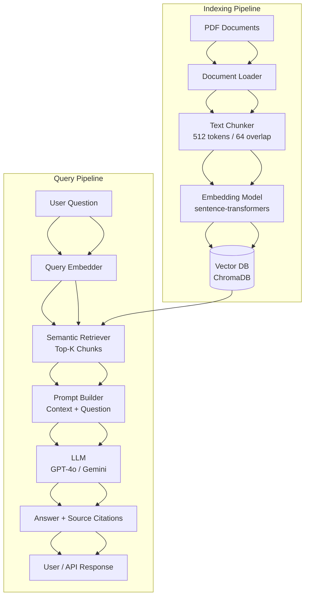

# 📖 How to Use the Copilot Instruction Files

This guide explains **step-by-step** how to use the instruction `.md` files in the `instructions/` folder to implement any user story — from idea to a fully documented, tested, production-ready feature.

Works for **all project types**:
- 🤖 AI / ML pipelines (classification, regression, clustering)
- 🔍 RAG (Retrieval-Augmented Generation) applications
- 🧠 LLM-powered apps (ChatBots, Agents, summarisers)
- 🖥️ Python scripts and utility tools
- 📓 Jupyter Notebook explorations and experiments
- 🌐 REST APIs (FastAPI / Flask)

---

## 📂 Folder Structure

```
.github/
├── copilot-instructions.md          ← Master instructions (auto-loaded by Copilot)
├── HOW-TO-USE.md                    ← This guide
└── instructions/
    ├── feature-planning.instructions.md
    ├── user-story-template.instructions.md
    ├── architecture-diagram.instructions.md
    ├── developer-guide.instructions.md
    ├── user-guide.instructions.md
    ├── unit-testing.instructions.md
    ├── integration-testing.instructions.md
    ├── swagger-doc.instructions.md
    ├── tester-template.instructions.md
    └── readme.instructions.md
```

---

## 🔄 The 11-Step Workflow — For Every User Story

Follow these steps **in order** every time you implement a new feature or user story. Each step references a specific instruction file.

---

### ✅ STEP 1 — Write the Feature Plan
**File:** `instructions/feature-planning.instructions.md`

Before touching any code, document the feature.

**What to do:**
1. Open the instruction file to understand the required structure.
2. Create a new file: `docs/feature-plans/FEAT-XXX_<name>.md`
3. Fill in all sections: Feature Summary, Problem Statement, Goals, Out of Scope, Technical Design, Risks, Milestones, and Definition of Done.

**Prompt Copilot:**
> "Create a feature planning document for [feature name] following the feature-planning instructions."

---

### ✅ STEP 2 — Write the User Story
**File:** `instructions/user-story-template.instructions.md`

Turn the feature plan into actionable user stories.

**What to do:**
1. Create a new file: `docs/user-stories/US-XXX_<name>.md`
2. Write the story in Connextra format: *As a / I want / So that*
3. Define all **Acceptance Criteria** in Given / When / Then format.
4. Set Story Points, Priority, and Status.

**Prompt Copilot:**
> "Write a user story for US-XXX: [short title] following the user-story-template instructions."

---

### ✅ STEP 3 — Design the Architecture Diagram
**File:** `instructions/architecture-diagram.instructions.md`

Visualise the system before writing code.

**What to do:**
1. Create a new file: `docs/diagrams/<feature>_architecture.md`
2. Choose the right diagram type: Data Flow, Pipeline, Sequence, or Component.
3. Use Mermaid syntax embedded in the Markdown file.
4. Label all components, data flows, and external systems.

**Prompt Copilot:**
> "Generate an architecture diagram for [feature name] as a Mermaid flowchart following the architecture-diagram instructions."

---

### ✅ STEP 4 — Implement the Feature
**File:** `copilot-instructions.md` (General Principles section)

Now write the actual code.

**What to do:**
1. Create modules under `src/` (e.g., `ingest.py`, `preprocess.py`, `train.py`).
2. Follow all general principles: type hints, NumPy docstrings, modular functions, no hardcoded paths.
3. Reference the User Story ID in code comments: `# US-XXX: description`
4. Validate inputs, handle exceptions, and use `logging` — not `print`.

**Prompt Copilot:**
> "Implement [function/module name] for US-XXX following the general coding principles."

---

### ✅ STEP 5 — Write Unit Tests
**File:** `instructions/unit-testing.instructions.md`

Test every function in isolation.

**What to do:**
1. Create `tests/test_<module_name>.py` for each source file.
2. Write tests for happy path, edge cases (empty data, nulls), and error cases.
3. Use `pytest` fixtures in `conftest.py` for shared test data.
4. Mock all file I/O and external calls.
5. Run: `pytest tests/ -v` — all must pass ✅

**Prompt Copilot:**
> "Write unit tests for [function_name] in [module_name] following the unit-testing instructions."

---

### ✅ STEP 6 — Write Integration Tests
**File:** `instructions/integration-testing.instructions.md`

Test all components working together as a pipeline.

**What to do:**
1. Add a small sample CSV to `tests/data/sample_integration.csv`
2. Create `tests/integration/test_pipeline_e2e.py`
3. Write stage handoff tests (Ingest → Preprocess → Features → Train → Evaluate).
4. Write a full E2E smoke test.
5. Add cleanup fixtures for any artifacts created.
6. Run: `pytest tests/integration/ -v` — all must pass ✅

**Prompt Copilot:**
> "Write integration tests for the full pipeline of [feature name] following the integration-testing instructions."

---

### ✅ STEP 7 — Write Swagger / API Docs *(if API is involved)*
**File:** `instructions/swagger-doc.instructions.md`

Document every REST endpoint if the feature exposes an API.

**What to do:**
1. Create or update `docs/swagger/swagger.yaml`
2. Document every endpoint: path, method, request body, response codes (200, 422, 500).
3. Add Pydantic `Field` descriptions if using FastAPI.
4. Include at least one concrete request/response example.

**Prompt Copilot:**
> "Generate Swagger/OpenAPI documentation for the /predict endpoint following the swagger-doc instructions."

> ⚠️ Skip this step if the feature does not expose an API.

---

### ✅ STEP 8 — Write the Developer Guide
**File:** `instructions/developer-guide.instructions.md`

Document the feature for other developers.

**What to do:**
1. Create `docs/developer-guides/dev_guide_<feature>.md`
2. Cover: Overview, Prerequisites, Project Structure, Setup, Configuration, Running the Pipeline, Module Reference, Coding Standards, Error Handling, Troubleshooting.
3. Link to the architecture diagram from Step 3.

**Prompt Copilot:**
> "Write a developer guide for [feature name] following the developer-guide instructions."

---

### ✅ STEP 9 — Write the User Guide
**File:** `instructions/user-guide.instructions.md`

Document the feature for end-users or business stakeholders.

**What to do:**
1. Create `docs/user-guides/guide_<feature>.md`
2. Write in plain, non-technical language (second person, active voice).
3. Include: Input Requirements table, step-by-step How to Use, Output Description, Interpreting Results, Limitations, FAQs, Glossary.

**Prompt Copilot:**
> "Write a user guide for [feature name] for a business analyst audience following the user-guide instructions."

---

### ✅ STEP 10 — Create the Tester / QA Template
**File:** `instructions/tester-template.instructions.md`

Create a formal test plan with documented test cases.

**What to do:**
1. Create `docs/tests/test_plan_<feature>.md`
2. Write at least 5 test cases: happy path, edge case, error case, performance, E2E integration.
3. Map every Acceptance Criterion from the user story (Step 2) to at least one test case.
4. After running tests, fill in "Actual Result" and "Status" for each test case.
5. Generate the Test Summary Report.

**Prompt Copilot:**
> "Generate a test plan with test cases for US-XXX: [story name] following the tester-template instructions."

---

### ✅ STEP 11 — Update the README
**File:** `instructions/readme.instructions.md`

Ensure the project is well documented at the top level.

**What to do:**
1. Create or update `README.md` in the project/feature folder.
2. Include: Overview, Project Structure, Getting Started, Usage, Configuration, Testing, Results.
3. Add real metric values (accuracy, F1, RMSE) once training is complete.
4. Link to: Swagger UI, developer guide, user guide, and architecture diagram.

**Prompt Copilot:**
> "Update the README for [project/feature name] following the readme instructions."

---

## 🏁 Definition of Done Checklist

Mark every item below before closing a user story:

```
STEP 1  ✅  Feature planning doc created          →  docs/feature-plans/FEAT-XXX_*.md
STEP 2  ✅  User story written with ACs            →  docs/user-stories/US-XXX_*.md
STEP 3  ✅  Architecture diagram created           →  docs/diagrams/*_architecture.md
STEP 4  ✅  Feature code implemented & reviewed    →  src/*.py
STEP 5  ✅  Unit tests passing (0 failures)        →  tests/test_*.py
STEP 6  ✅  Integration tests passing              →  tests/integration/test_*.py
STEP 7  ✅  Swagger docs updated (if API)          →  docs/swagger/swagger.yaml
STEP 8  ✅  Developer guide written                →  docs/developer-guides/*.md
STEP 9  ✅  User guide written                     →  docs/user-guides/*.md
STEP 10 ✅  Test plan & bug reports documented     →  docs/tests/test_plan_*.md
STEP 11 ✅  README updated with real metrics       →  README.md
```

> 🚫 A story is **NOT done** until all 11 boxes are checked.

---

## 💬 Quick Copilot Prompt Cheatsheet

| What you want | Prompt to use |
|---|---|
| Start a new feature | `"Plan FEAT-XXX: [name] following the feature-planning instructions"` |
| Write a user story | `"Write user story US-XXX for [feature] following the user-story-template instructions"` |
| Draw architecture | `"Create a Mermaid architecture diagram for [feature] following the architecture-diagram instructions"` |
| Generate unit tests | `"Write unit tests for [function] following the unit-testing instructions"` |
| Generate integration tests | `"Write integration tests for [pipeline/feature] following the integration-testing instructions"` |
| Document an API | `"Document the /predict endpoint in Swagger YAML following the swagger-doc instructions"` |
| Write dev docs | `"Write a developer guide for [module] following the developer-guide instructions"` |
| Write user docs | `"Write a user guide for [feature] following the user-guide instructions"` |
| Create a test plan | `"Generate a test plan for US-XXX following the tester-template instructions"` |
| Update README | `"Update README for [project] with real metrics following the readme instructions"` |

---

## 🧠 Applying This Workflow to Different Project Types

The 11-step workflow works for **every kind of Python or AI/ML project**. Below is a guide on which steps apply and how to adapt them.

---

### 🐍 Python Script / Utility Tool

| Step | Applies? | What to do |
|---|---|---|
| 1 Feature Plan | ✅ | Plan inputs, outputs, edge cases |
| 2 User Story | ✅ | Define who runs the script and why |
| 3 Architecture | ✅ | Simple flowchart of function calls |
| 4 Implementation | ✅ | `src/<tool_name>.py` with type hints, docstrings |
| 5 Unit Tests | ✅ | Test every function with `pytest` |
| 6 Integration | ✅ | Run script end-to-end with sample input file |
| 7 Swagger | ⚠️ Skip | Only if script has an HTTP endpoint |
| 8 Dev Guide | ✅ | Setup, how to run, config reference |
| 9 User Guide | ✅ | Plain-English instructions for the user |
| 10 Tester Plan | ✅ | Test plan checklist |
| 11 README | ✅ | `README.md` in the script folder |

---

### 📓 Jupyter Notebook (.ipynb) — Exploration or Analysis

| Step | Applies? | What to do |
|---|---|---|
| 1 Feature Plan | ✅ | Define hypothesis, dataset, and expected findings |
| 2 User Story | ✅ | "As a data scientist, I want to explore X so that..." |
| 3 Architecture | ✅ | Mermaid diagram as a Markdown cell in the notebook |
| 4 Implementation | ✅ | Build cells step by step: load → clean → analyse → visualise |
| 5 Unit Tests | ⚠️ Optional | Test helper functions extracted to `src/` |
| 6 Integration | ⚠️ Optional | Run notebook top-to-bottom with `nbmake` or `papermill` |
| 7 Swagger | ⚠️ Skip | Not applicable for notebooks |
| 8 Dev Guide | ✅ | How to re-run the notebook, required libraries |
| 9 User Guide | ✅ | Explain findings in plain English for stakeholders |
| 10 Tester Plan | ✅ | Cell-by-cell expected output checklist |
| 11 README | ✅ | `README.md` for the notebook folder |

**Notebook Cell-by-Cell Development with Copilot:**

Use these prompts to build and verify each cell progressively:

```
Cell 1 (markdown): "Generate a title and objective cell for this notebook"
Cell 2 (python):   "Write code to load and validate the dataset from data/raw/file.csv"
Cell 3 (python):   "Write code to explore data: shape, dtypes, nulls, describe()"
Cell 4 (python):   "Write code to clean data: drop nulls, fix dtypes, encode categoricals"
Cell 5 (python):   "Write code to visualise key distributions using seaborn with titles and labels"
Cell 6 (python):   "Write code to build and train [model/pipeline]"
Cell 7 (python):   "Write code to evaluate the model and display metrics in a table"
Cell 8 (markdown): "Generate a Findings and Next Steps summary cell"
```

After each cell is generated, verify it with Copilot:
```
"Does cell N output match acceptance criteria AC-X from user story US-XXX?"
```

---

### 🤖 AI / ML Pipeline

| Step | Applies? | What to do |
|---|---|---|
| 1 Feature Plan | ✅ | Define model type, target metric, dataset |
| 2 User Story | ✅ | "As an analyst, I want predictions so that..." |
| 3 Architecture | ✅ | Full pipeline: ingest → preprocess → features → train → evaluate → serve |
| 4 Implementation | ✅ | `src/ingest.py`, `preprocess.py`, `train.py`, `evaluate.py` |
| 5 Unit Tests | ✅ | Test each pipeline stage function |
| 6 Integration | ✅ | E2E pipeline smoke test on sample data |
| 7 Swagger | ✅ | If model is served via FastAPI `/predict` endpoint |
| 8 Dev Guide | ✅ | Full pipeline run instructions |
| 9 User Guide | ✅ | How to interpret prediction scores |
| 10 Tester Plan | ✅ | Test plan with performance and accuracy ACs |
| 11 README | ✅ | Include model metrics (accuracy, F1, ROC-AUC) |

---

### 🔍 RAG (Retrieval-Augmented Generation) Pipeline

| Step | Applies? | What to do |
|---|---|---|
| 1 Feature Plan | ✅ | Define document corpus, embedding model, LLM, retrieval strategy |
| 2 User Story | ✅ | "As a user, I want to query documents using natural language so that..." |
| 3 Architecture | ✅ | Mermaid: Documents → Chunking → Embedding → Vector DB → Retrieval → LLM → Answer |
| 4 Implementation | ✅ | `src/loader.py`, `chunker.py`, `embedder.py`, `retriever.py`, `generator.py` |
| 5 Unit Tests | ✅ | Test chunking, embedding shape, retrieval top-k |
| 6 Integration | ✅ | E2E: query → retrieve relevant chunks → LLM generates answer |
| 7 Swagger | ✅ | `POST /query` endpoint: input question, output answer + sources |
| 8 Dev Guide | ✅ | Vector DB setup, API keys, model config |
| 9 User Guide | ✅ | How to ask questions, understanding source citations |
| 10 Tester Plan | ✅ | Test retrieval accuracy, answer relevance, hallucination checks |
| 11 README | ✅ | Include retrieval metrics (MRR, Hit@K, faithfulness score) |

---

### 🧠 LLM App (Chatbot, Summariser, Agent)

| Step | Applies? | What to do |
|---|---|---|
| 1 Feature Plan | ✅ | Define LLM provider (OpenAI, Gemini, local), prompt strategy, memory |
| 2 User Story | ✅ | "As a user, I want to chat with my documents so that..." |
| 3 Architecture | ✅ | User → Prompt Builder → LLM API → Response Parser → UI/API |
| 4 Implementation | ✅ | `src/prompt_builder.py`, `llm_client.py`, `memory.py`, `app.py` |
| 5 Unit Tests | ✅ | Test prompt templates, response parsing, token limits |
| 6 Integration | ✅ | E2E: send question → get LLM response → validate format |
| 7 Swagger | ✅ | `POST /chat` endpoint with conversation history |
| 8 Dev Guide | ✅ | API key setup, model selection, rate limit handling |
| 9 User Guide | ✅ | How to use the chatbot, what it can and cannot answer |
| 10 Tester Plan | ✅ | Test answer quality, fallback handling, prompt injection safety |
| 11 README | ✅ | Include example prompts and sample outputs |

---

## 🔍 End-to-End RAG Pipeline — Worked Example

This example shows exactly how to apply all 11 steps to build a **RAG pipeline** that lets users query a set of PDF documents using natural language.

---

### STEP 1 — Feature Plan

**Prompt Copilot:**
> `"Create a feature planning document for FEAT-001: PDF Question Answering RAG Pipeline following the feature-planning instructions."`

**Output:** `docs/feature-plans/FEAT-001_rag_pdf_qa.md`

```
Feature Name    : PDF Question Answering RAG Pipeline
Feature ID      : FEAT-001
Algorithm       : sentence-transformers embeddings + ChromaDB + OpenAI GPT-4o
Success Criteria:
  - Retrieval Hit@3 >= 80% on test question set
  - Answer faithfulness score >= 0.85
  - API response time < 3 seconds
```

---

### STEP 2 — User Story

**Prompt Copilot:**
> `"Write user story US-001 for the RAG PDF QA feature following the user-story-template instructions."`

**Output:** `docs/user-stories/US-001_pdf_qa.md`

```
As a research analyst,
I want to ask natural language questions about a set of PDF reports,
So that I get accurate answers with source citations without reading every document.

AC-1: Given a question, When I call POST /query, Then I receive a relevant answer
AC-2: Given an answer, Then it includes the source document name and page number
AC-3: Given an out-of-scope question, Then the system responds "I don't know"
AC-4: Given 100 questions, When the pipeline runs, Then Hit@3 retrieval >= 80%
```

---

### STEP 3 — Architecture Diagram

**Prompt Copilot:**
> `"Generate a Mermaid architecture diagram for the RAG PDF QA pipeline following the architecture-diagram instructions."`

**Output:** `docs/diagrams/FEAT-001_rag_architecture.md`



---

### STEP 4 — Implementation (Python Modules)

**Project structure:**
```
rag_pdf_qa/
├── src/
│   ├── loader.py          # Load and parse PDFs page by page
│   ├── chunker.py         # Split text into overlapping chunks
│   ├── embedder.py        # Generate sentence-transformer embeddings
│   ├── vector_store.py    # ChromaDB insert and query
│   ├── retriever.py       # Top-K semantic search
│   ├── prompt_builder.py  # Build LLM prompt from context + question
│   ├── generator.py       # Call LLM and parse answer + sources
│   └── app.py             # FastAPI: POST /query, POST /index
```

**Prompt Copilot for each module in order:**

```
"Implement src/loader.py — load all PDFs from a folder using PyMuPDF,
 extract text per page, return list of dicts {filename, page, content}.
 Add type hints and NumPy docstrings. Follow general coding principles."

"Implement src/chunker.py — split page content into overlapping chunks
 of 512 tokens with 64-token overlap using LangChain
 RecursiveCharacterTextSplitter. Return list of chunk dicts with metadata."

"Implement src/embedder.py — generate embeddings using sentence-transformers
 all-MiniLM-L6-v2, accept list of strings, return numpy array of shape
 (N, 384). Handle empty input with a ValueError."

"Implement src/vector_store.py — insert chunks + embeddings into a ChromaDB
 collection. Expose insert(chunks, embeddings) and query(question, top_k=3)
 methods. Return list of dicts with content, filename, page, score."

"Implement src/retriever.py — embed the user question using embedder.py,
 call vector_store.query(top_k=3), return sorted results by score."

"Implement src/prompt_builder.py — build a prompt string using a
 system message, numbered context chunks, and the user question.
 Enforce a max_context_tokens limit of 2000."

"Implement src/generator.py — call OpenAI GPT-4o with the prompt,
 parse the response, return dict with keys: answer (str) and
 sources (list of {filename, page})."

"Implement src/app.py — FastAPI app with POST /query (accepts question,
 returns answer + sources) and POST /index (accepts folder_path, indexes
 all PDFs). Follow swagger-doc instructions for endpoint documentation."
```

---

### STEP 4b — Notebook Version (.ipynb)

For step-by-step exploration before building production `.py` modules:

**Filename:** `notebooks/explore_rag_pipeline_2026-03-27.ipynb`

**Prompt Copilot cell by cell:**

```
Cell 1 (markdown): "Generate a title and objective markdown cell for a RAG
                    pipeline exploration notebook. Include hypothesis, dataset
                    used, and expected outcome."

Cell 2 (python):   "Write code to load all PDFs from data/pdfs/ using PyMuPDF.
                    Print document count and total pages."

Cell 3 (python):   "Write code to chunk the loaded text using LangChain
                    RecursiveCharacterTextSplitter, chunk_size=512, overlap=64.
                    Display first 3 chunks with their metadata."

Cell 4 (python):   "Write code to generate embeddings for the first 10 chunks
                    using sentence-transformers all-MiniLM-L6-v2. Print shape."

Cell 5 (python):   "Write code to insert all chunk embeddings into a local
                    ChromaDB collection called 'pdf_docs'. Print total items."

Cell 6 (python):   "Write code to query ChromaDB with:
                    question = 'What is the Q3 revenue?'
                    Display top-3 retrieved chunks with source file and page."

Cell 7 (python):   "Write code to build a RAG prompt from retrieved chunks and
                    call OpenAI GPT-4o. Display the answer and source citations."

Cell 8 (markdown): "Generate a Findings and Next Steps markdown summary cell."
```

**After each cell, verify with Copilot:**
```
"Does cell 6 output satisfy AC-1 from US-001 (question returns relevant chunks)?"
"Does cell 7 output include source document name and page number per AC-2?"
```

---

### STEP 5 — Unit Tests

**Prompt Copilot:**
> `"Write unit tests for src/chunker.py, src/embedder.py and src/retriever.py following the unit-testing instructions."`

Key tests generated:
```python
# chunker.py tests
test_chunker_returns_non_empty_list_for_valid_text()
test_chunker_chunk_length_within_token_limit()
test_chunker_handles_empty_string_gracefully()

# embedder.py tests
test_embedder_output_shape_matches_input_count()
test_embedder_returns_numpy_array()
test_embedder_raises_value_error_on_empty_input()

# retriever.py tests
test_retriever_returns_exactly_top_k_results()
test_retriever_results_contain_required_keys()   # filename, page, content, score
test_retriever_scores_are_between_0_and_1()
```

---

### STEP 6 — Integration Tests

**Prompt Copilot:**
> `"Write integration tests for the full RAG pipeline: load → chunk → embed → store → retrieve → generate following the integration-testing instructions."`

Key E2E test:
```python
def test_full_rag_pipeline_returns_answer_with_sources():
    # Index 1 sample PDF
    # Send a known question
    # Assert: answer is a non-empty string
    # Assert: sources list has at least 1 entry
    # Assert: each source has filename and page keys
    # Assert: total response time < 3 seconds
```

---

### STEP 7 — Swagger Docs

**Prompt Copilot:**
> `"Generate Swagger YAML for POST /query and POST /index endpoints following the swagger-doc instructions."`

```yaml
POST /query:
  request:  { "question": "What is the Q3 revenue?" }
  response: { "answer": "Q3 revenue was $4.2B",
              "sources": [{"file": "annual_report.pdf", "page": 12}] }

POST /index:
  request:  { "folder_path": "data/pdfs/" }
  response: { "indexed_chunks": 1842, "documents_processed": 5 }
```

---

### STEP 8 — Developer Guide

**Prompt Copilot:**
> `"Write a developer guide for the RAG PDF QA pipeline following the developer-guide instructions."`

Key sections:
```
Prerequisites : Python 3.11+, OpenAI API key, ChromaDB, sentence-transformers
Setup         : pip install -r requirements.txt
                Create .env with: OPENAI_API_KEY=sk-...
Running       : uvicorn src.app:app --reload  →  localhost:8000
Config keys   : chunk_size, overlap, top_k, llm_model, embedding_model
Troubleshooting:
  - "Collection not found" → call POST /index first to index PDFs
  - "Rate limit error"     → add exponential backoff in generator.py
  - "Empty answer"         → lower similarity_threshold in config.yaml
```

---

### STEP 9 — User Guide

**Prompt Copilot:**
> `"Write a user guide for the RAG PDF QA system for a non-technical business analyst following the user-guide instructions."`

Key sections:
```
How to ask a question:
  Send POST /query with: { "question": "What is the Q3 revenue?" }
  
Interpreting results:
  "answer" field  → the direct answer from the documents
  "sources" field → which PDF and page the answer came from
  
Limitations:
  - Only answers questions based on indexed PDFs
  - Maximum 3 source citations per answer
  - Cannot answer questions about data not in the documents

FAQ:
  Q: Why did it say "I don't know"?
  A: The answer was not found in the indexed documents.
```

---

### STEP 10 — Tester Template

**Prompt Copilot:**
> `"Generate a test plan for US-001 RAG PDF QA following the tester-template instructions."`

| TC | Test Case | Expected Result | Status |
|---|---|---|---|
| TC-001 | Query with known question from indexed PDF | Returns correct answer + source citation | ⬜ |
| TC-002 | Query with out-of-scope question | Returns "I don't know" | ⬜ |
| TC-003 | Query with empty string | Returns HTTP 422 validation error | ⬜ |
| TC-004 | Index 5 PDFs (~1000 pages) | Completes in < 60 seconds | ⬜ |
| TC-005 | Run 100 test questions | Hit@3 retrieval accuracy >= 80% | ⬜ |

---

### STEP 11 — README

**Prompt Copilot:**
> `"Update README.md for the RAG PDF QA project with real metrics following the readme instructions."`

```markdown
## Key Results
| Metric                | Value                  |
|-----------------------|------------------------|
| Retrieval Hit@3       | 84%                    |
| Answer Faithfulness   | 0.88                   |
| Avg API Response Time | 1.8s                   |
| Documents Indexed     | 5 PDFs / 1,842 chunks  |
```

---

## 💬 Quick Copilot Prompt Cheatsheet

| What you want | Prompt to use |
|---|---|
| Start a new feature | `"Plan FEAT-XXX: [name] following the feature-planning instructions"` |
| Write a user story | `"Write user story US-XXX for [feature] following the user-story-template instructions"` |
| Draw architecture | `"Create a Mermaid architecture diagram for [feature] following the architecture-diagram instructions"` |
| Generate a `.py` module | `"Implement src/[module].py with type hints and NumPy docstrings following the general coding principles"` |
| Generate notebook cells | `"Write a notebook cell to [action]. Verify it matches AC-X from US-XXX"` |
| Verify a notebook cell | `"Does cell N output satisfy AC-X from US-XXX user story?"` |
| Generate unit tests | `"Write unit tests for [function] following the unit-testing instructions"` |
| Generate integration tests | `"Write integration tests for [pipeline/feature] following the integration-testing instructions"` |
| Document an API | `"Document the /[endpoint] in Swagger YAML following the swagger-doc instructions"` |
| Write dev docs | `"Write a developer guide for [module] following the developer-guide instructions"` |
| Write user docs | `"Write a user guide for [feature] following the user-guide instructions"` |
| Create a test plan | `"Generate a test plan for US-XXX following the tester-template instructions"` |
| Update README | `"Update README for [project] with real metrics following the readme instructions"` |
| Review code quality | `"Review src/[module].py for PEP8, type hints, docstrings and error handling"` |

---

## 🏁 Definition of Done Checklist

Mark every item below before closing a user story:

```
STEP 1  ✅  Feature planning doc created          →  docs/feature-plans/FEAT-XXX_*.md
STEP 2  ✅  User story written with ACs            →  docs/user-stories/US-XXX_*.md
STEP 3  ✅  Architecture diagram created           →  docs/diagrams/*_architecture.md
STEP 4  ✅  Feature code implemented & reviewed    →  src/*.py  or  notebooks/*.ipynb
STEP 5  ✅  Unit tests passing (0 failures)        →  tests/test_*.py
STEP 6  ✅  Integration tests passing              →  tests/integration/test_*.py
STEP 7  ✅  Swagger docs updated (if API)          →  docs/swagger/swagger.yaml
STEP 8  ✅  Developer guide written                →  docs/developer-guides/*.md
STEP 9  ✅  User guide written                     →  docs/user-guides/*.md
STEP 10 ✅  Test plan & bug reports documented     →  docs/tests/test_plan_*.md
STEP 11 ✅  README updated with real metrics       →  README.md
```

> 🚫 A story is **NOT done** until all 11 boxes are checked.

---

## 📁 Recommended Output Folder Structure

```
project/                              (e.g., rag_pdf_qa/)
├── src/
│   ├── __init__.py
│   ├── loader.py
│   ├── chunker.py
│   ├── embedder.py
│   ├── vector_store.py
│   ├── retriever.py
│   ├── prompt_builder.py
│   ├── generator.py
│   └── app.py
├── notebooks/
│   └── explore_rag_pipeline_2026-03-27.ipynb
├── tests/
│   ├── conftest.py
│   ├── test_chunker.py
│   ├── test_embedder.py
│   ├── test_retriever.py
│   └── integration/
│       ├── test_pipeline_e2e.py
│       └── data/
│           └── sample.pdf
├── docs/
│   ├── feature-plans/            # Step 1
│   ├── user-stories/             # Step 2
│   ├── diagrams/                 # Step 3
│   ├── developer-guides/         # Step 8
│   ├── user-guides/              # Step 9
│   ├── tests/                    # Step 10
│   └── swagger/                  # Step 7
├── data/
│   └── pdfs/
├── models/
├── config.yaml
├── .env                          # API keys — never commit to git
├── requirements.txt
└── README.md                     # Step 11
```
