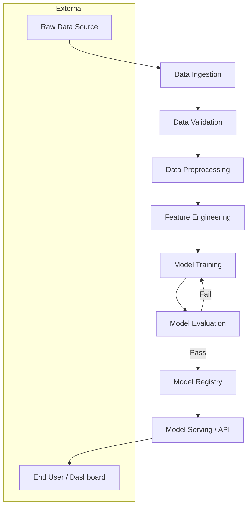
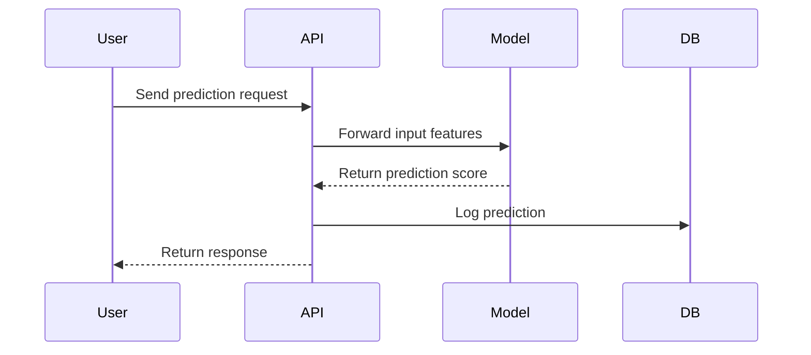
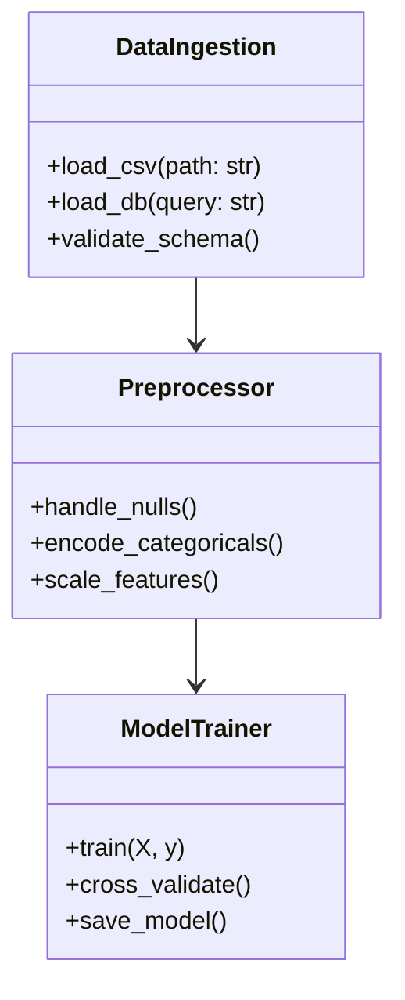

# Architecture Diagram Instructions

## Purpose
Generate clear, consistent architecture diagrams for every feature or system built in this DS/ML workspace. Diagrams must communicate data flow, component relationships, and system boundaries.

---

## 📐 When to Create an Architecture Diagram

- Before implementing any new ML pipeline or data workflow
- When introducing a new module, service, or integration
- When refactoring an existing system
- As part of any feature planning document

---

## 🗂️ Diagram Types to Generate

| Diagram Type | Use Case | Tool |
|---|---|---|
| **System Context** | High-level view of the system and its external actors | Mermaid / draw.io |
| **Data Flow Diagram (DFD)** | How data moves through the pipeline | Mermaid flowchart |
| **Component Diagram** | Internal modules and their relationships | Mermaid classDiagram |
| **Sequence Diagram** | Step-by-step interaction between components | Mermaid sequenceDiagram |
| **Pipeline Diagram** | ML pipeline stages (ingest → preprocess → train → evaluate → serve) | Mermaid flowchart |
| **ER Diagram** | Data model relationships | Mermaid erDiagram |

---

## ✍️ Diagram Standards

### Always Include
- **Title** at the top of every diagram
- **Legend** if custom shapes or colors are used
- **Data direction arrows** (show the flow clearly)
- **Component labels** (no unnamed boxes)
- **External systems** clearly separated from internal ones (dashed boundary)

### Naming Conventions for Components
- Use `PascalCase` for component/module names (e.g., `DataIngestion`, `ModelTrainer`)
- Use `snake_case` for data artifacts (e.g., `raw_data`, `processed_features`)
- Prefix external services with `EXT:` (e.g., `EXT: S3 Bucket`)

---

## 🧱 Standard ML Pipeline Architecture Template



---

## 📋 Architecture Diagram Checklist

- [ ] Title and description added
- [ ] All data sources identified
- [ ] All transformations/processing steps shown
- [ ] All output artifacts labeled
- [ ] External systems separated
- [ ] Failure/retry paths shown (if applicable)
- [ ] Diagram saved as `.md` (Mermaid) or `.png`/`.svg` in the `docs/diagrams/` folder

---

## 📁 File Storage Convention

```
docs/
└── diagrams/
    ├── architecture_overview.md
    ├── data_pipeline_flow.md
    ├── model_training_sequence.md
    └── system_context.md
```

---

## 🔧 Mermaid Diagram Quick Reference





---

## ✅ Copilot Behavior for Diagrams

- Always embed diagrams using Mermaid syntax inside Markdown files
- When asked to design a feature, **generate the architecture diagram first** before writing code
- Suggest diagram updates when new components or integrations are added
- Store diagrams alongside the feature documentation in `docs/diagrams/`
